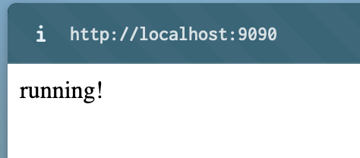

# Backend for CWC Admin System

### Teck stack: 
- DB: Mysql 
- Rest Service: Sprint Boot

## Run SprintBoot App
1. install maven
```shell
brew install mvn
```
2. build application
```shell
# run the following cmd under project directory
mvn clean package
```
3. Open project in IntelliJ: File > Open > (select the project folder)
4. Find the entry class `src/main/java/com.example.cwc_backend_springboot/CwcBackendSpringbootApplication.java`
5. Right click the file, select "Run \"CwcBackendSpringbootApplication\"". You will see the output as below.
```
  .   ____          _            __ _ _
 /\\ / ___'_ __ _ _(_)_ __  __ _ \ \ \ \
( ( )\___ | '_ | '_| | '_ \/ _` | \ \ \ \
 \\/  ___)| |_)| | | | | || (_| |  ) ) ) )
  '  |____| .__|_| |_|_| |_\__, | / / / /
 =========|_|==============|___/=/_/_/_/
 :: Spring Boot ::                (v3.2.3)
...
2024-04-16T12:33:21.298-07:00  INFO 82708 --- [CWC_backend_springboot] [           main] o.s.b.w.embedded.tomcat.TomcatWebServer  : Tomcat initialized with port 9090 (http)
...
2024-04-16T12:33:21.711-07:00  INFO 82708 --- [CWC_backend_springboot] [           main] c.e.c.CwcBackendSpringbootApplication    : Started CwcBackendSpringbootApplication in 1.744 seconds (process running for 2.298)
```
6. Open http://localhost:9090/, if you can see as below, your app is up running now!



## Set up Mysql
1. install mysql
```shell
brew install mysql
# Note: set password `root` for user `root` when prompt
```
2. setup DB and import tables
```shell
# run commands under project directory
brew services start mysql
# enter mysql
mysql -u root -p # input "root" for password
source  mySQL_db/cwc_db_dump-cwc_db-v2.sql;
# check if tables are imported
show tables;
exit;
```
3. Run Sprint Boot App and open http://localhost:9090/testdb, mysql is connected if you can see message below.

4. **[optional]** Mysql GUI: mysql workbench [download link](https://dev.mysql.com/doc/workbench/en/wb-installing.html).